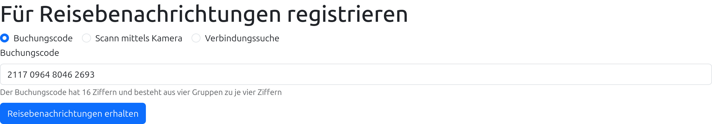
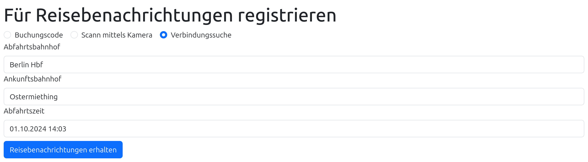
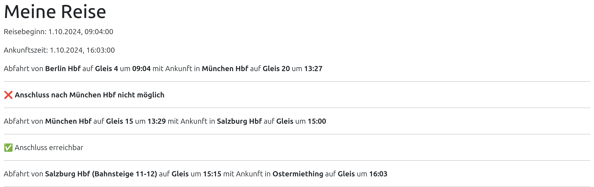
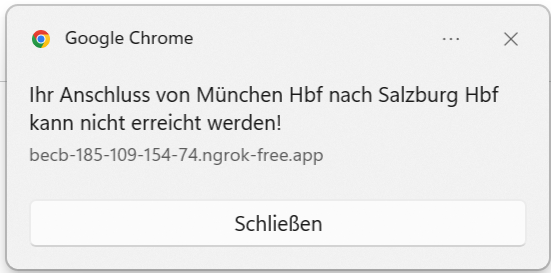

# Just-In

Just-In is a solution that provides relevant and timely information about the impact of a delay to a user.
In other words, it tells a user if she or he will arrive on time and what to do in case of a delay.

## Application Flow

The flow chart below assumes the following itinerary in which the user misses a connection due to a delay and thus has to take an alternative train.

The flow chart captures the entire workflow with dependencies to external systems for the above mentioned journey.

### Results

Our research has shown that our concept is feasible and we created a minimum PoC using the DB RIS APIs. Furthermore, we identified [suitable SBB APIs](https://developer.sbb.ch/apis/siri-v20/information) suitable for the task at hand.

Moreover, our architecture allows integration into existing applications.

However, we had to little time and too few developers to implement the entire concept. Moreover, we reported a reproducible bug in the DB RIS::Trips API confirmed by developer Thies. As discussed with developer Thies, we found a mocking workaround for the issue.

### Prototype - Web Front End

The user is able to register for journey updates using the booking code.

The user is able to register for journey updates using the connection search.

A user is informed about delays and if she or he can reach each connecting train.

The user is informed about a delay using a notification.

## Architecture

We designed an interoperable structure that allows plugging in several front ends and back ends.

The Just-In web frontend REST API provides an easy API that can be embedded in mobile applications, such as [SBB Mobile](https://www.sbb.ch/en/travel-information/apps/sbb-mobile.html), [DB Navigator](https://www.bahn.de/service/mobile/db-navigator) or [ÖBB Scotty](https://www.oebb.at/de/fahrplan/fahrplanauskunft/scottymobil).
Furthermore, we provide a web frontend that can be embedded as a web view.

The back end defines a unified API that allows connecting a railway operator's solution into a European-wide application.

In addition, a user's bookings can be imported into the notification service via our uniform interface. This allows a user to view delays and updates without any interaction no matter with which railway operator they made the booking with.
The railway operator's ticketing system just imports the booking details into Just-In and the user doesn't have to do anything else but to open the web site.

